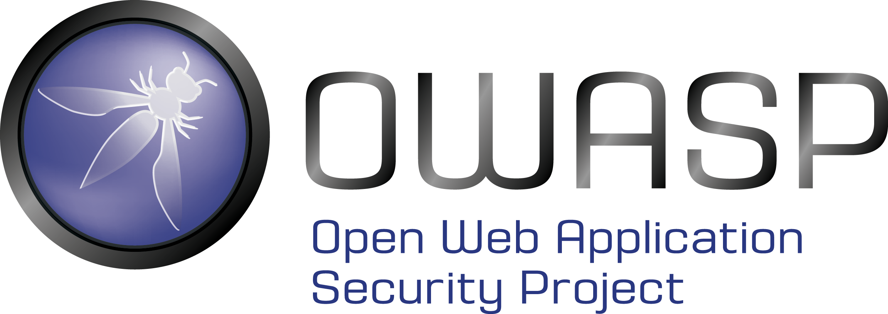
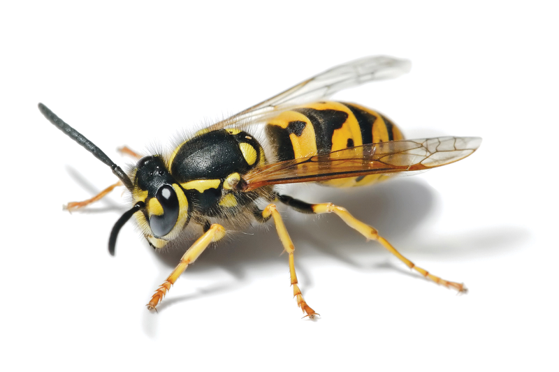

# Os dez mais críticos riscos de segurança de API

Uma tradução para o português do Brasil do projeto original "The Ten Most Critical API Security Risks"

March 10th, 2020

| | | |
| - | - | - |
| https://owasp.org | Este trabalho é licenciado sob a [Atribuição-CompartilhaIgual 4.0 Internacional (CC BY-SA 4.0)][1] |  |

[1]: https://creativecommons.org/licenses/by-sa/4.0/deed.pt_BR
