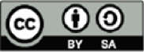

# OWASP के बारे में

Open Worldwide Application Security Project (OWASP) एक खुला समुदाय है, जो
संगठनों को ऐसे एप्लिकेशन और API विकसित करने, खरीदने और बनाए रखने में सक्षम
बनाने के लिए समर्पित है जिन पर भरोसा किया जा सके।

OWASP में आपको निःशुल्क और खुले रूप में ये सब मिलेगा:

* एप्लिकेशन सुरक्षा (Application Security) के टूल्स और मानक।
* एप्लिकेशन सुरक्षा परीक्षण, सुरक्षित कोड विकास और सुरक्षित कोड समीक्षा
  (secure code review) पर पूरी किताबें।
* प्रेजेंटेशन और [वीडियो][1]।
* कई आम विषयों पर [चीट शीट्स][2]।
* मानक सुरक्षा नियंत्रण (security controls) और लाइब्रेरी।
* [दुनिया भर में फैले स्थानीय चैप्टर][3]।
* अत्याधुनिक शोध।
* [दुनिया भर में होने वाले प्रमुख कॉन्फ़्रेंस][4]।
* [मेलिंग लिस्ट][5] ([संग्रह][6])।

अधिक जानकारी यहाँ पाएँ: [https://www.owasp.org][7]।

OWASP के सभी टूल्स, दस्तावेज़, वीडियो, प्रेजेंटेशन और चैप्टर उन सभी लोगों के
लिए निःशुल्क और खुले हैं जो एप्लिकेशन सुरक्षा को बेहतर बनाने में रुचि रखते हैं।

हमारा मानना है कि एप्लिकेशन सुरक्षा को लोगों, प्रक्रिया और तकनीक की समस्या के
रूप में देखा जाना चाहिए, क्योंकि इस क्षेत्र के सबसे कारगर उपाय इन्हीं तीनों में
सुधार पर निर्भर करते हैं।

OWASP एक नए किस्म का संगठन है। व्यापारिक दबावों से मुक्त होने के कारण ही हम
एप्लिकेशन सुरक्षा के बारे में निष्पक्ष, व्यावहारिक और किफ़ायती जानकारी दे पाते
हैं।

OWASP किसी भी तकनीकी कंपनी से संबद्ध नहीं है, हालाँकि हम व्यावसायिक सुरक्षा
तकनीक के समझदारी भरे उपयोग का समर्थन करते हैं। OWASP कई तरह की सामग्री
सहयोगात्मक, पारदर्शी और खुले तरीके से तैयार करता है।

OWASP Foundation वह गैर-लाभकारी संस्था है जो इस प्रोजेक्ट की दीर्घकालिक
सफलता सुनिश्चित करती है। OWASP से जुड़े लगभग सभी लोग स्वयंसेवक हैं, जिनमें
OWASP बोर्ड, चैप्टर लीडर, प्रोजेक्ट लीडर और प्रोजेक्ट सदस्य शामिल हैं। हम
नई सुरक्षा शोध को अनुदान (grants) और इंफ़्रास्ट्रक्चर का सहयोग देते हैं।

आइए, हमसे जुड़िए!

## कॉपीराइट और लाइसेंस

कॉपीराइट © 2003-2023 The OWASP Foundation। यह दस्तावेज़ [Creative Commons
Attribution Share-Alike 4.0 license][8] के अंतर्गत जारी किया गया है। किसी भी
पुनः उपयोग या वितरण के लिए, आपको दूसरों को इस कार्य की लाइसेंस शर्तें स्पष्ट
रूप से बतानी होंगी।

[1]: https://www.youtube.com/user/OWASPGLOBAL
[2]: https://cheatsheetseries.owasp.org/
[3]: https://owasp.org/chapters/
[4]: https://owasp.org/events/
[5]: https://groups.google.com/a/owasp.org/forum/#!overview
[6]: https://lists.owasp.org/mailman/listinfo
[7]: https://www.owasp.org
[8]: http://creativecommons.org/licenses/by-sa/4.0/
